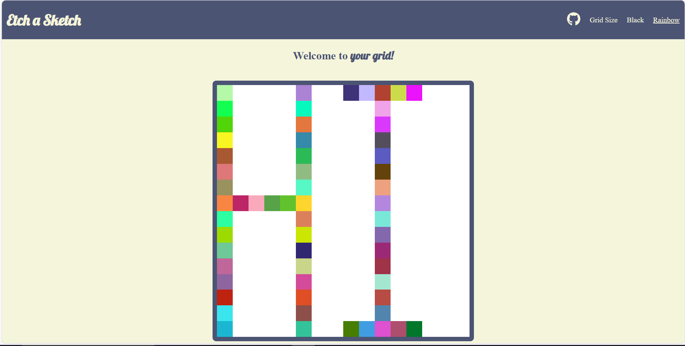

  

<h3 align="center">Etch a Sketch</h3>

  

   Welcome to Etch A Sketch, you can use this website by clicking on grid in the top-right corner and specifying a size (default is 16). You can then select either black or rainbow from the navbar. Hovering over the boxes colors them. Have Fun :D
     
    <a href="https://github.com/hossam-allam/rock-paper-scissors"><strong>You're here already probably</strong></a>
     
     
    <a href="https://hossam-allam.github.io/rock-paper-scissors/">View Demo</a>
  

